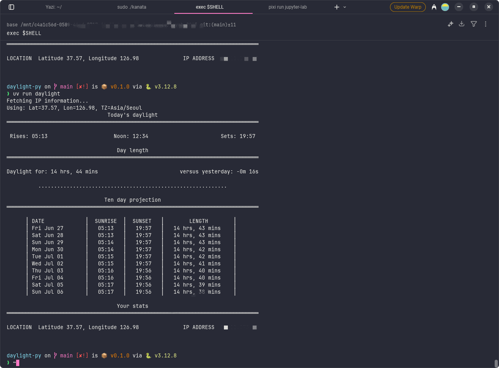

## Daylight Python 버전



이 프로그램은 Go 언어로 작성된 `daylight` 명령줄 프로그램(원작: jbreckmckye)을 Python으로 포팅한 것입니다. 일출, 일몰, 태양 정오 시간, 낮의 길이를 표시하고, 향후 10일간의 이러한 변화를 예측하여 보여줍니다. 이 도구는 기본적으로 IP 기반 위치 정보(ipinfo.io를 통해)를 사용하며, 위치 및 시간대를 수동으로 지정할 수도 있습니다.

## 주요 기능

  * 일출, 일몰, 태양 정오 및 낮의 길이를 계산합니다.
  * 정상적인 낮/밤 주기, 극일(백야) 및 극야(흑야) 조건을 모두 처리합니다.
  * IP 주소를 기반으로 위치 데이터를 가져옵니다(인터넷 필요).
  * 오프라인 사용 또는 특정 위치 지정을 위해 위도, 경도 및 시간대를 수동으로 재정의할 수 있습니다.
  * 세 가지 출력 형식을 제공합니다:
      * 자세하고 읽기 쉬운 전체 텍스트(기본값).
      * 간결한 요약 (`--short`).
      * 기계 판독을 위한 JSON 출력 (`--json`).
  * 향후 10일간의 낮 길이 변화 예측을 보여줍니다(전체 보기에서).

## 요구 사항

  * 라이브러리: `requests`, `pytz`, `astral` (`requirements.txt` 참조)

## 사용법

1.  **의존성 설치:**

    ```bash
    pip install -r requirements.txt
    ```

    또는 

    ```bash
    uv sync
    ```

2.  **스크립트 실행 (설치 후 또는 직접):**
    설치된 경우 (예: `pip install .`):

    ```bash
    uv run daylight [OPTIONS]
    ```


    **예시:**

      * IP 위치에 대한 오늘 데이터 가져오기:

        ```bash
        uv run daylight
        ```

      * 위치 및 시간대 재정의 (세 가지 값 모두 제공 시 오프라인 작업 가능):

        ```bash
        uv run daylight --latitude="-33.92" --longitude="18.42" --timezone="Africa/Johannesburg"
        ```

      * 간략한 요약:

        ```bash
        uv run daylight --short
        ```

      * JSON 출력:

        ```bash
        uv run daylight --json
        ```

      * 다른 날짜 데이터:

        ```bash
        uv run daylight --date="2025-12-31"
        ```

      * 도움말 보기:

        ```bash
        uv run daylight --help
        ```

## 개발

  * **테스트 실행:**
    ```bash
    uv run pytest
    ```

## 원본 Go 프로젝트

원본 Go 버전 및 더 자세한 내용은 다음을 참조하세요:
[https://github.com/jbreckmckye/daylight](https://github.com/jbreckmckye/daylight)

## 라이선스

이 Python 포트 또한 원본 프로젝트와 동일한 라이선스(GPL)에 따라 제공됩니다. Go 프로젝트의 원본 `LICENSE` 파일이 이 저장소에 포함되어 있습니다. 전체 라이선스 세부 정보는 해당 파일을 참조하시기 바랍니다.