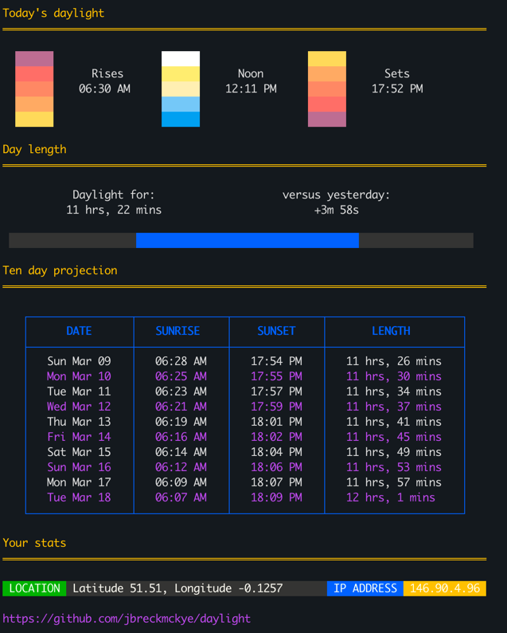

# daylight

a command-line program for tracking sunrise and sunset times (Mac / Linux)



It tells you the sunrise, sunset, solar noon times and day length. It also projects these changes over the
next ten days.

`daylight` uses your IP-based location and timezone to tailor the results to your geometry. It works in (ant)arctic
locations, and you can override the IP location if you're travelling / on a VPN.

I love the sunlight and dread the long, dark winter evenings of Northern Europe. I often look up sunrise / sunset times
and count off the days until the dreary darkness is gone.

(IP lookup is powered by https://ipinfo.io. They provide a good service so please don't spam requests.)

## Installation

### Homebrew (MacOS and Linux)

```shell
# Add my tap (formula repository)
brew tap jbreckmckye/formulae
# Install daylight
brew install daylight
# Check it
daylight --help
```

### Manual installation (and Windows)

Pick up the executable for your system in the [releases](https://github.com/jbreckmckye/daylight/releases).
Unzip the package and put the program in a folder that's within your system `PATH`.

There is a Windows binary but I haven't been able to test this. Let me know if you get it working.

## Usage

```shell
# Today's data for your IP location
daylight

# Override the IP location and timezone
daylight --loc "-33.92,18.42" --timezone "Africa/Johannesburg"

# Short summary of the data
daylight --short

# Data for another date
daylight --date="2025-12-31"

# Disable the colour output
NO_COLOR=true daylight

# Show help
daylight --help
```

Daylight will attempt to adapt to your terminal background colour (dark vs light) but this might not work well for your
colour scheme. In this case you can use `NO_COLOR` to disable any colours

```
$ NO_COLOR=true daylight

Today's daylight
════════════════════════════════════════════════════════════════════════════


             Rises                 Noon                  Sets
           06:30 AM              12:11 PM              17:52 PM


Day length
════════════════════════════════════════════════════════════════════════════

           Daylight for:                    versus yesterday:
          11 hrs, 22 mins                        +3m 58s

 ....................R---------------------------------S..................

Ten day projection
════════════════════════════════════════════════════════════════════════════

   ┌────────────────┬──────────────┬──────────────┬─────────────────────┐
   │      DATE      │   SUNRISE    │    SUNSET    │       LENGTH        │
   ├────────────────┼──────────────┼──────────────┼─────────────────────┤
   │   Sun Mar 09   │   06:28 AM   │   17:54 PM   │   11 hrs, 26 mins   │
   │   Mon Mar 10   │   06:25 AM   │   17:55 PM   │   11 hrs, 30 mins   │
   │   Tue Mar 11   │   06:23 AM   │   17:57 PM   │   11 hrs, 34 mins   │
   │   Wed Mar 12   │   06:21 AM   │   17:59 PM   │   11 hrs, 37 mins   │
   │   Thu Mar 13   │   06:19 AM   │   18:01 PM   │   11 hrs, 41 mins   │
   │   Fri Mar 14   │   06:16 AM   │   18:02 PM   │   11 hrs, 45 mins   │
   │   Sat Mar 15   │   06:14 AM   │   18:04 PM   │   11 hrs, 49 mins   │
   │   Sun Mar 16   │   06:12 AM   │   18:06 PM   │   11 hrs, 53 mins   │
   │   Mon Mar 17   │   06:09 AM   │   18:07 PM   │   11 hrs, 57 mins   │
   │   Tue Mar 18   │   06:07 AM   │   18:09 PM   │   12 hrs, 1 mins    │
   └────────────────┴──────────────┴──────────────┴─────────────────────┘

Your stats
════════════════════════════════════════════════════════════════════════════

 LOCATION  Latitude 51.51, Longitude -0.1257        IP ADDRESS  146.90.4.96
```

There is also a short summary mode

```
$ daylight --short
Rises:  06:30 AM
Sets:   17:52 PM
Length: 11 hrs, 22 mins
Change:  +3m 58s
```

## Codebase

I wrote this project to learn Go, so don't expect anything too amazing. Feel free to raise issues.

The terminal UI library is [lipgloss](https://github.com/charmbracelet/lipgloss).

```
⠀⠀⠀⠀⠀⠀⠀⠀⠀⠀⠀⠀ ⠀⠀⠀⠀⢀⡀⠀⠀⠀⠀⠀⠀⠀⠀⠀⠀⠀
⠀⠀⠀⠀⠀⠀⠀⢠⠀⠀⠀⠀⠀⠀⠀⠀⢰⣿⡀⠀⠀⠀⠀⠀⠀⠀⠀⠀⠀⠀
⠀⠀⠀⠀⠀⠀⠀⠸⣷⣦⣀⠀⠀⠀⠀⠀⣿⣿⡇⠀⠀⠀⠀⠀⠀⠀⠀⠀⠀⠀
⠀⠀⠀⠀⠀⠀⠀⠀⠙⣿⣿⣿⣦⠀⠠⠾⠿⣿⣷⠀⠀⠀⠀⠀⣠⣤⣄⠀⠀⠀
⠀⠀⠀⠀⠀⠀⠀⠀⠀⢸⠟⢉⣠⣤⣶⡆⠀⣠⣈⠀⢀⣠⣴⣿⣿⠋⠀⠀⠀⠀
⠀⢀⡀⢀⣀⣀⣠⣤⡄⢀⣀⡘⣿⣿⣿⣷⣼⣿⣿⣷⡄⠹⣿⡿⠁⠀⠀⠀⠀⠀
⠀⠀⠻⠿⢿⣿⣿⣿⠁⣼⣿⣿⣿⣿⣿⣿⣿⣿⣿⣟⣁⠀⠋⠀⠀⠀⠀⠀⠀⠀
⠀⠀⠀⠀⠀⠀⠈⠻⠀⣿⣿⣿⣿⣿⣿⣿⣿⣿⣿⣿⣿⡇⢰⣄⣀⠀⠀⠀⠀⠀
⠀⠀⠀⠀⠀⠀⠀⣠⡀⠀⣴⣿⣿⣿⣿⣿⣿⣿⡿⢿⡿⠀⣾⣿⣿⣿⣿⣶⡄⠀
⠀⠀⠀⠀⠀⢀⣾⣿⣷⡀⠻⣿⣿⡿⠻⣿⣿⣿⣿⠀⠀⠈⠉⠉⠉⠀⠀⠀⠀⠀
⠀⠀⠀⠀⣠⣾⡿⠟⠉⠉⠀⢀⡉⠁⠀⠛⠛⢉⣠⣴⣧⠀⠀⠀⠀⠀⠀⠀⠀⠀
⠀⠀⠀⠈⠉⠉⠀⠀⠀⠀⠀⢸⣿⣿⡿⠉⠀⠙⠿⣿⣿⣧⡀⠀⠀⠀⠀⠀⠀⠀
⠀⠀⠀⠀⠀⠀⠀⠀⠀⠀⠀⠘⣿⣿⠁⠀⠀⠀⠀⠀⠙⠿⣷⠀⠀⠀⠀⠀⠀⠀
⠀⠀⠀⠀⠀⠀⠀⠀⠀⠀⠀⠀⣿⠟⠀⠀⠀⠀⠀⠀⠀⠀ ⠃⠀⠀⠀⠀⠀⠀⠀
⠀⠀⠀⠀⠀⠀⠀⠀⠀⠀⠀⠀⠀⠀⠀⠀⠀⠀⠀⠀⠀⠀⠀⠀⠀⠀⠀⠀⠀⠀
```
